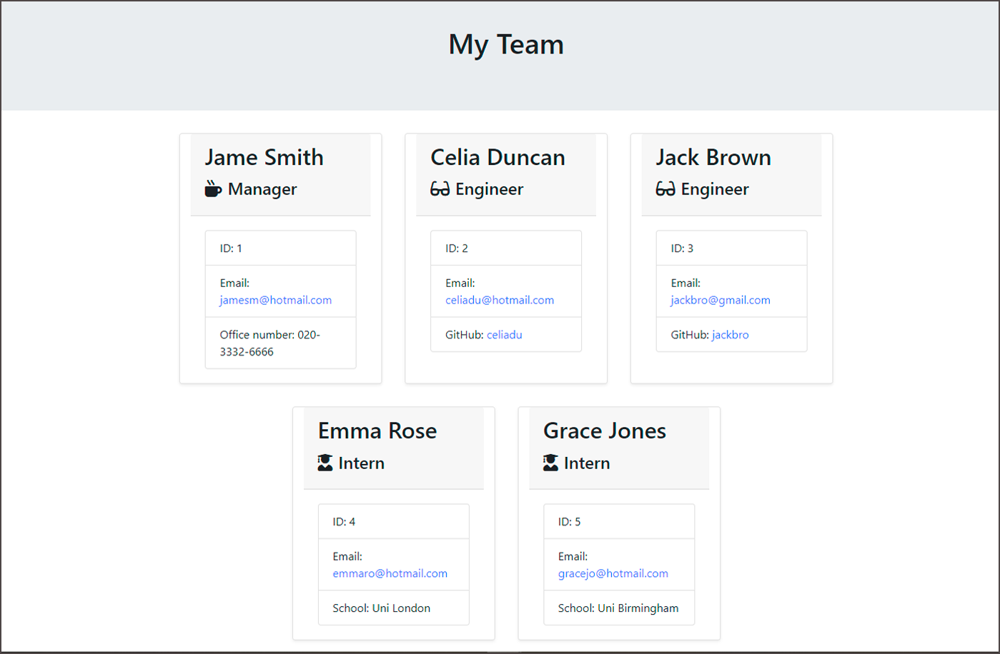

# Team-Profile-Generator-Node
Module 12 Object-Oriented Programming: Team Profile Generator

 

## Description
This Team-Profile-Generator-Node was created for bootcamp students who were taking the twelfth week's challenge. In this challenge, my task was to create a command-line application that takes in information about employees on a software engineering team, then generates an HTML webpage that displays summaries for each person.

The team profile generator application must meet the following critical requirements:
* Create a command-line application that accepts user input using the provided starter code. 
  * Create classes for each team member provided and export them. The tests for these classes (in the `_tests_` directory) must ALL pass.
     * `Employee` parent class include: `name`, `id`, `email`, `getName()`, `getId()`, `getEmail()`, `getRole()`&mdash;returns `'Employee'` 

     * `Manager` class extend from `Employee` include: `officeNumber`, `getOfficeNumber()`, `getRole()`&mdash;overridden to return `'Manager'`

     * `Engineer` class extend from `Employee` include: `github`&mdash;GitHub username, `getGithub()`, `getRole()`&mdash;overridden to return `'Engineer'`

     * `Intern` class extend from `Employee` include: `school`, `getSchool()`, `getRole()`&mdash;overridden to return `'Intern'`

* Write code in `index.js` that uses inquirer to gather information about the development team members and creates objects for each team member using the correct classes as blueprints.
  * When a user starts the application then they are prompted to enter the **Manager**’s: Name, Employee ID, Email address, Office number

  * When a user enters those requirements then the user is presented with a menu with the option to: **Engineer**, **Intern**, **None**

  * When a user selects the **Engineer** option then a user is prompted to enter the following and then the user is taken back to the menu: Engineer's Name, ID, Email, GitHub username

  * When a user selects the **Intern** option then a user is prompted to enter the following and then the user is taken back to the menu: Intern’s name, ID, Email, School
     
  * When a user selects the **None** option then they exit the application, and the HTML is generated.

* Call the `render` function and pass in an array containing all employee objects; 
  * The `render` function will generate and return a block of HTML including templated divs for each employee!

* Create an HTML file using the HTML returned from the `render` function. 
  * Write it to a file named `team.html` in the `output` folder. 
  * Use the provided variable `outputPath` to target this location.

## Table Of Contents

  * [Installation](#installation)

  * [Usage](#usage)

  * [License](#license)

  * [Tests](#tests)

## Installation

To install Inquirer package, run the following command:

```
npm i
```

## Usage

To use the Team-Profile-Generator-Node, you can download or clone this repository.

To check whether the application meets critical requirements, open [team.html](https://github.com/qingh2o/Team-Profile-Generator-Node/blob/main/output/team.html) file.

The "team.html" page should look similar to the screenshot below.




To view walkthrough Demo, watch the video below:

**Jest Test Video**


https://github.com/qingh2o/Team-Profile-Generator-Node/assets/144452799/373453ff-6006-4eda-ab78-20088466d15d


**App Video**


https://github.com/qingh2o/Team-Profile-Generator-Node/assets/144452799/de6c06ea-cf68-4115-ab6d-bc65e1fed32c


## License

This project is licensed under the MIT license.

## Tests

* To test this application whether pass the [Jest](https://www.npmjs.com/package/jest) unit tests, use the following command:

  ```bash
  npm run test
  ```

* To test whether the [Inquirer](https://www.npmjs.com/package/inquirer) collects user input, and generates the correct html file.
  * First, run the application using the following command:

  ```bash
  node index.js
  ```

  * Then, use the command line to answer questions about your team members.

  * The application will generate a `team.html` in the `output` folder. 
